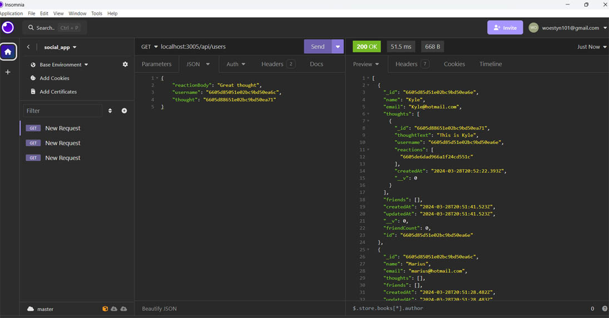

# Social app

## Description

This project challenged me to use a mongodb database 
and interact with it using node.js and the mongoose package.

During this project I learned how to:

- create a mongodb database.
- make a connection with the database.
- create Models and Routes.
- use mongodb compass.
- use virtuals in mongoose.
- validate email address.
- use Insomnia to test the database.
- set up routes with express.

## Table of Contents:

[Installation](#Installation)
[Video Link](#video)
[Usage](#usage)
[Credits](#credits)
[License](#license)

## Installation 

 Clone repository to local machine
- run npm install
- To start the progam run: node injex.js
- to create database with tables/models
- use Insomnia to run CRUD operations on routes.
  
## Video

https://drive.google.com/file/d/1wnwqNXqbFcw0-7IS5ksbhcvEcwnGEOuQ/view?usp=sharing

## Usage

This app provides an easy and accessible way for a for a social app user to view and manage his/her thoughts, friends and reaction to other friend's thoughts. 

## Screenshot of app

## Credits: Resources used

I used and modified code from the following resources:

https://www.youtube.com/watch?v=98BzS5Oz5E4&list=PL4cUxeGkcC9iJ_KkrkBZWZRHVwnzLIoUE

https://www.youtube.com/watch?v=DZBGEVgL2eE

https://stackoverflow.com/questions/18022365/mongoose-validate-email-syntax

## License

MIT
